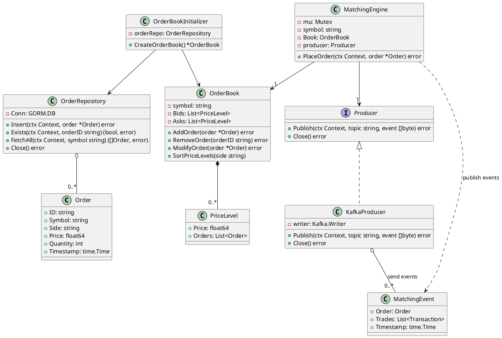

# Class UML

```plantuml
@startuml
' Define Models
class Order {
    +ID: string
    +Symbol: string
    +Side: string
    +Price: float64
    +Quantity: int
    +Timestamp: time.Time
}

class MatchingEvent {
    +Order: Order
    +Trades: List<Transaction>
    +Timestamp: time.Time
}

interface Producer {
    +Publish(ctx Context, topic string, event []byte) error
    +Close() error
}

' Define Producer Implementation
class KafkaProducer {
    -writer: Kafka.Writer
    +Publish(ctx Context, topic string, event []byte) error
    +Close() error
}

Producer <|.. KafkaProducer


' Define OrderBook
class OrderBook {
    -symbol: string
    -Bids: List<PriceLevel>
    -Asks: List<PriceLevel>
    +AddOrder(order *Order) error
    +RemoveOrder(orderID string) error
    +ModifyOrder(order *Order) error
    +SortPriceLevels(side string)
}

class PriceLevel {
    +Price: float64
    +Orders: List<Order>
}

' Define MatchingEngine
class MatchingEngine {
    -mu: Mutex
    -symbol: string
    -Book: OrderBook
    -producer: Producer
    +PlaceOrder(ctx Context, order *Order) error
}

' Define OrderRepository
class OrderRepository {
    -Conn: GORM.DB
    +Insert(ctx Context, order *Order) error
    +Exists(ctx Context, orderID string) (bool, error)
    +FetchAll(ctx Context, symbol string) ([]Order, error)
    +Close() error
}

' Define OrderBookInitializer
class OrderBookInitializer {
    -orderRepo: OrderRepository
    +CreateOrderBook() *OrderBook
}

' Define Relationships

' OrderBook Composes PriceLevels
OrderBook *-- "0..*" PriceLevel

' MatchingEngine Uses Producer and Repositories
MatchingEngine --> "1" Producer
MatchingEngine --> "1" OrderBook
MatchingEngine ..> MatchingEvent : publish events

' Repositories Aggregate Models
OrderRepository o-- "0..*" Order


' OrderBook Initialization Process
OrderBookInitializer --> OrderRepository
OrderBookInitializer --> OrderBook

KafkaProducer o-- "0..*" MatchingEvent: send events

@enduml
```