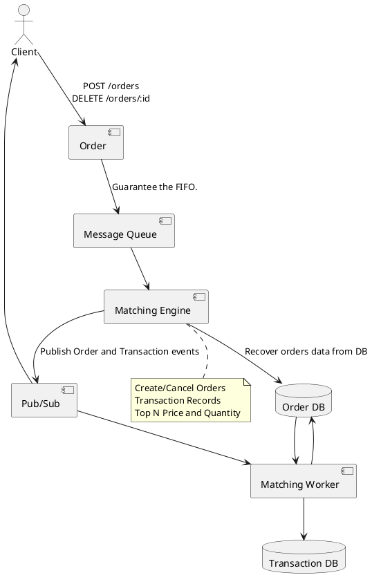

# System Architecture

```plantuml
@startuml
actor Client
[Order]
[Message Queue]
[Matching Engine]
database "Transaction DB"
database "Order DB"
[Pub/Sub]
[Matching Worker]

Client --> [Order]: POST /orders\nDELETE /orders/:id
[Order] --> [Message Queue]: Guarantee the FIFO.
[Message Queue] --> [Matching Engine]
[Matching Engine] --> [Pub/Sub]: Publish Order and Transaction events
[Matching Engine] --> [Order DB]: Recover orders data from DB
[Pub/Sub] --> [Matching Worker]
[Pub/Sub] --> Client
[Matching Worker] --> "Transaction DB"
[Matching Worker] --> "Order DB"
[Order DB] --> [Matching Worker]

note bottom of [Matching Engine]
  Create/Cancel Orders
  Transaction Records
  Top N Price and Quantity
end note
@enduml

```